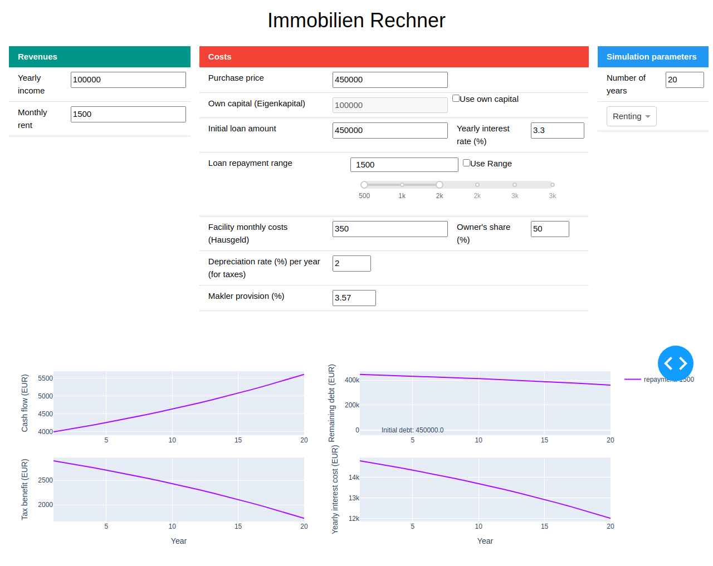

# Property Optimizer
This repository is for simulating cash-flows of a property given few parameters.


# Development
## Requirments
1. Install `poetry` (version `1.8.3`)
    ```bash
   pip install poetry==1.8.3 
   ```
2. Run `poetry install --all-extras`
## Tests
For executing tests, run: 
```bash
poetry run pytest
```
## Running in debug mode
After installing the requirements you can run the application in debug mode using
```bash
poetry run app --debug-mode --port 8050 # Choose your own port.
```
Then the application is available under `http://localhost:8050`.


## Docker
You can also run the application in debug mode using Docker. For that you need 
to have `docker` and `docker-compose` installed on your system.
1. Building image and starting the container
    ```bash
    docker compose up -d
    ```
2. Access the application under `http://localhost:8050`
3. Stop the container 
    ```bash
   docker compose stop
    ```
